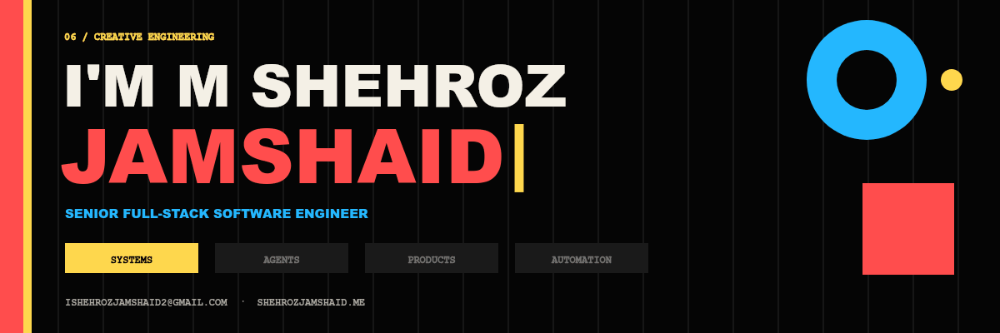
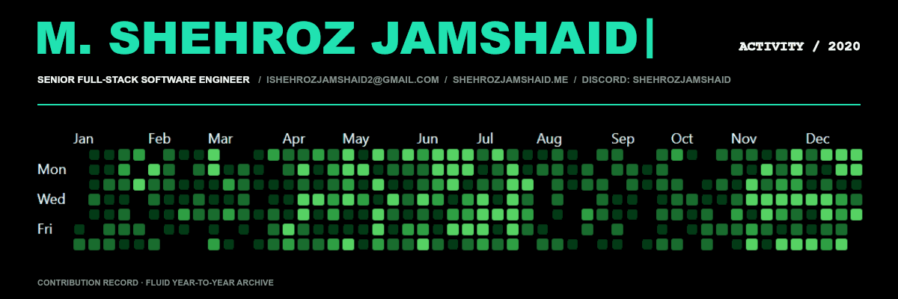
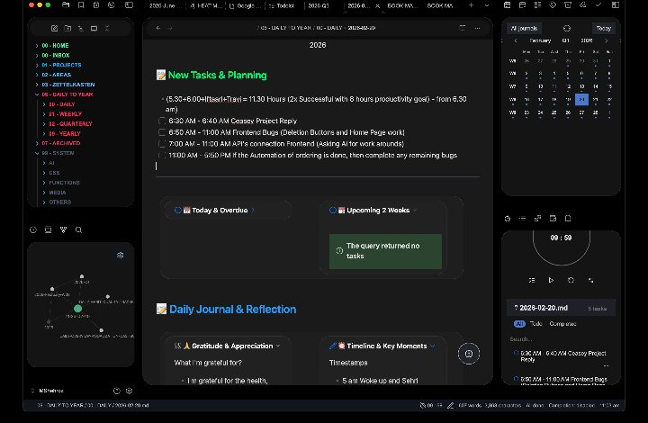
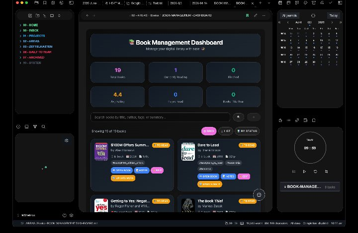
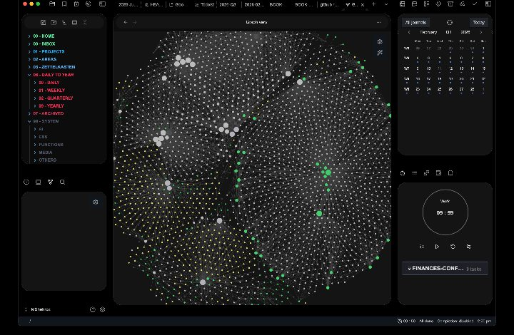
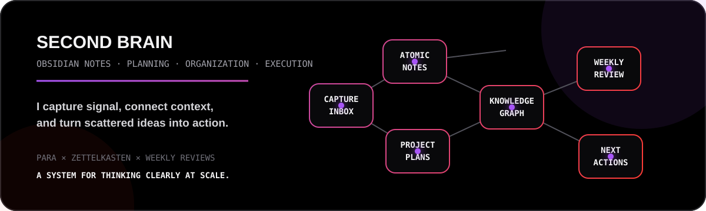

  

  

  
  
  
  
  
  

  
  
  
  
  

 

<table>
  <tr>
    <td width="67%" valign="top">
      <h2>⚡ A Very Passionate and Curious Engineer.</h2>
      

        I'm <strong>M Shehroz Jamshaid</strong>—a full-stack software engineer with
        <strong><!-- EXPERIENCE_TEXT_START -->6 years of experience<!-- EXPERIENCE_TEXT_END --></strong> building and shipping production-grade web platforms,
        AI-powered workflows, distributed services, and cloud infrastructure.
      

      

        <strong>I do my best work where product ambition meets engineering complexity.</strong>
        I turn uncertain ideas into sound architecture, align teams around an executable plan,
        and engineer for the scale, reliability, and real-world pressure that arrive after launch.
      

      
<em>The goal: ship faster today without creating tomorrow's bottleneck.</em>

      

        <code>Product thinking</code> × <code>Systems engineering</code> × <code>Technical leadership</code>
      

      <ul>
        <li>🤖 Building with LLM workflows, agents, sub-agents, MCP, LangChain, and LangGraph</li>
        <li>🏗️ Designing APIs, microservices, multi-tenant platforms, and distributed systems</li>
        <li>📈 Optimizing databases, latency, throughput, reliability, and developer velocity</li>
        <li>🌍 Open to high-impact senior engineering and technical-lead opportunities</li>
      </ul>
    </td>
    <td width="33%" align="center" valign="middle">
      
        
      
       
      
       
      
    </td>
  </tr>
</table>

---

<h2 align="center">⚡ Engineering Impact, Measured.</h2>

  

  

  
  
  
  

Contribution history, a fresh thought on every visit, and production metrics drawn from real engineering work.

---

<h2 align="center">🧠 What I Engineer</h2>

<table>
  <tr>
    <td width="25%" align="center" valign="top">
      <h3>🤖 AI Systems</h3>
      
Agentic workflows, tool use, document intelligence, multi-step reasoning, prompt and token optimization.

    </td>
    <td width="25%" align="center" valign="top">
      <h3>⚙️ Platforms</h3>
      
REST, GraphQL and gRPC APIs; microservices; event-driven systems; multi-tenant SaaS architecture.

    </td>
    <td width="25%" align="center" valign="top">
      <h3>☁️ Cloud</h3>
      
AWS infrastructure, containers, Kubernetes, Terraform, GitOps, CI/CD, observability, and reliability.

    </td>
    <td width="25%" align="center" valign="top">
      <h3>📊 Scale</h3>
      
Database performance, caching, queues, idempotency, failure recovery, throughput, and low latency.

    </td>
  </tr>
</table>

<pre align="center"><code>IDEA  ──►  PRODUCT  ──►  PLATFORM  ──►  SCALE  ──►  RELIABLE OPERATIONS
             │              │             │                  │
          React/Next     APIs/Agents   Data/Queues      Cloud/GitOps</code></pre>

---

<h2 align="center">🤖 Agent Forks, Automation Labs & Vibe-Coded Experiments</h2>

  I love <strong>vibe coding</strong>: moving quickly from intent to working software while keeping engineering judgment in the loop. 
  I also love managing <strong>agents, sub-agents, tools, context, and automations</strong> as one coordinated delivery system.

<blockquote>
  A large part of my production work lives inside <strong>company-private repositories</strong>. The repositories below are the public edge of that work: agent frameworks, MCP infrastructure, automation patterns, and open-source systems I fork, study, run, and extend.
</blockquote>

<table>
  <tr>
    <td width="50%" valign="top">
      <h3><a href="https://github.com/MShehrozJamshaid/nanocodex">⚙️ nanocodex</a> · fork</h3>
      
Frontier OpenAI-agent building blocks in Rust—small enough to understand, serious enough to experiment with.

      
<code>Rust</code> <code>Agents</code> <code>Tool use</code>

    </td>
    <td width="50%" valign="top">
      <h3><a href="https://github.com/MShehrozJamshaid/openai-agents-python">🧠 OpenAI Agents Python</a> · fork</h3>
      
A practical foundation for handoffs, guardrails, tracing, tools, and multi-agent orchestration.

      
<code>Python</code> <code>Handoffs</code> <code>Tracing</code>

    </td>
  </tr>
  <tr>
    <td width="50%" valign="top">
      <h3><a href="https://github.com/MShehrozJamshaid/github-mcp-server">🔌 GitHub MCP Server</a> · fork</h3>
      
GitHub's official MCP server: repository context, issues, pull requests, and developer workflows exposed to agents.

      
<code>Go</code> <code>MCP</code> <code>Developer tools</code>

    </td>
    <td width="50%" valign="top">
      <h3><a href="https://github.com/MShehrozJamshaid/servers">🧰 MCP Servers</a> · fork</h3>
      
A working library of Model Context Protocol servers for connecting models to real tools and data.

      
<code>TypeScript</code> <code>MCP</code> <code>Integrations</code>

    </td>
  </tr>
  <tr>
    <td width="50%" valign="top">
      <h3><a href="https://github.com/MShehrozJamshaid/langgraph">🕸️ LangGraph</a> · fork</h3>
      
Durable, stateful agent workflows with branching, persistence, human-in-the-loop control, and recovery.

      
<code>Python</code> <code>Graphs</code> <code>Agent orchestration</code>

    </td>
    <td width="50%" valign="top">
      <h3><a href="https://github.com/MShehrozJamshaid/cline">🛰️ Cline</a> · fork</h3>
      
An autonomous coding-agent workspace for exploring planning, file operations, tool execution, and feedback loops.

      
<code>TypeScript</code> <code>Coding agents</code> <code>Automation</code>

    </td>
  </tr>
  <tr>
    <td width="50%" valign="top">
      <h3><a href="https://github.com/MShehrozJamshaid/OpenHands">👐 OpenHands</a> · fork</h3>
      
An open platform for software-development agents that can reason, execute, revise, and collaborate.

      
<code>Agents</code> <code>Software engineering</code> <code>Evaluation</code>

    </td>
    <td width="50%" valign="top">
      <h3><a href="https://github.com/MShehrozJamshaid/ai">▲ Vercel AI SDK</a> · fork</h3>
      
Streaming AI interfaces, structured generation, tool calling, and production-ready application patterns.

      
<code>TypeScript</code> <code>Generative UI</code> <code>Tool calling</code>

    </td>
  </tr>
</table>

  

---

<h2 align="center">🧰 Technology Universe</h2>

<h3 align="center">Languages & Frontend</h3>

  

<h3 align="center">Backend, APIs & Data</h3>

  

  
  
  
  

<h3 align="center">Cloud, Infrastructure & Delivery</h3>

  

  
  

<h3 align="center">AI & Agentic Engineering</h3>

  
  
  
  
  
  
  

---

<h2 align="center">🐍 Open Source Is Part of My Practice</h2>

<table>
  <tr>
    <td width="58%" valign="top">
      
I’m an <strong>open-source contributor</strong> who learns in public, explores modern developer tooling, and contributes where a thoughtful idea, fix, or technical perspective can help.

      
That includes a contribution to <strong>Microsoft Visual Studio Code</strong>, alongside contributions and hands-on work across smaller local and community projects. My current open-source exploration is especially focused on AI agents, MCP servers, developer tools, and cloud-native systems.

      
<a href="https://github.com/microsoft/vscode/issues/248482">Microsoft VS Code contribution →</a>

    </td>
    <td width="42%" align="center" valign="middle">
      
        
      
        
      
    </td>
  </tr>
</table>

  <picture>
    <source media="(prefers-color-scheme: dark)" srcset="https://raw.githubusercontent.com/MShehrozJamshaid/MShehrozJamshaid/output/github-contribution-grid-snake-dark.svg" />
    <source media="(prefers-color-scheme: light)" srcset="https://raw.githubusercontent.com/MShehrozJamshaid/MShehrozJamshaid/output/github-contribution-grid-snake.svg" />
    
  </picture>

The snake updates automatically through GitHub Actions after the profile repository is pushed.

---

<h2 align="center">🛰️ GitHub Telemetry</h2>

  
  

  
  

<strong>Note:</strong> Language cards describe the composition of public repositories—not proficiency or years of experience.

---

<h2 align="center">🧬 Contribution Matrix</h2>

  

<h2 align="center">🏗️ Experience Timeline</h2>

<table>
  <thead>
    <tr>
      <th>Chapter</th>
      <th>Role</th>
      <th>Selected impact</th>
    </tr>
  </thead>
  <tbody>
    <tr>
      <td><strong>StratNova</strong> May 2024 — Present</td>
      <td><strong>Senior Software Engineer</strong></td>
      <td>Shipped full-stack AI applications and agentic workflows; cut manual client workloads by 50%; improved API response times by 30% across three platforms.</td>
    </tr>
    <tr>
      <td><strong>Alphabridge</strong> Jul 2022 — Apr 2024</td>
      <td><strong>Lead Software Engineer</strong></td>
      <td>Led a six-engineer product team; built an 8K RPS service; architected 2M+ daily-message infrastructure; coordinated a zero-downtime AWS migration.</td>
    </tr>
    <tr>
      <td><strong>Techverx</strong> Jan 2020 — Jun 2022</td>
      <td><strong>Intern & Software Engineer</strong></td>
      <td>Modernized a Rails monolith into NestJS services; optimized a 150M-row analytics dataset; designed isolation for 50+ enterprise tenants.</td>
    </tr>
  </tbody>
</table>

  
<strong>More leadership data</strong>

   
  <ul>
    <li>Mentored <strong>3 junior engineers</strong>; 2 advanced to mid-level within 18 months.</li>
    <li>Conducted <strong>40+ technical interviews</strong>, supporting team growth from 15 to 32.</li>
    <li>Introduced Architecture Decision Records organization-wide, reducing decision-related rework by <strong>40%</strong>.</li>
    <li>Owned architecture, quality standards, and quarterly technical roadmaps for cross-functional delivery.</li>
  </ul>

---

<h2 align="center">🧠 Obsidian, Organization & My Second Brain</h2>

<table>
  <tr>
    <td width="33%" align="center" valign="top">
       
      <strong>01 · Capture & Plan</strong> 
      Daily journals, tasks, calendars, reflections, and a clear plan for what happens next.
    </td>
    <td width="33%" align="center" valign="top">
       
      <strong>02 · Organize & Learn</strong> 
      Books, project knowledge, decisions, research, and reusable patterns—organized, not buried.
    </td>
    <td width="33%" align="center" valign="top">
       
      <strong>03 · Connect & Retrieve</strong> 
      A connected knowledge graph turns scattered notes into a searchable, living second brain.
    </td>
  </tr>
</table>

  
  I’m a deliberate <strong>organizer, note maker, and planner</strong>. My Obsidian vault is not a document graveyard—it is an operating system for thinking, building, reviewing, and remembering.

---

<h2 align="center">🎓 Foundation & Operating Style</h2>

<table>
  <tr>
    <td width="50%" valign="top">
      <h3>Computer Science</h3>
      
<strong>BS Computer Science</strong> FAST–National University of Computer and Emerging Sciences, Lahore

      
Data structures, algorithms, databases, operating systems, networks, OOP, AI, machine learning, and web engineering.

    </td>
    <td width="50%" valign="top">
      <h3>How I work</h3>
      
Remote-first communicator · Architecture decision records · Code review · Technical roadmapping · Agile delivery · Product/engineering translation.

      
Outside production code, I maintain my <strong>Obsidian-based second brain</strong>: a living system for notes, projects, planning, reflection, and AI-native developer workflows.

    </td>
  </tr>
</table>

---

  <h2>🤝 Let's build something that matters—and scales.</h2>
  
If you're working on an ambitious product, an AI-native workflow, or a platform with hard systems problems, I'd love to hear about it.

  
  
  
    
  <code>Discord: shehrozjamshaid</code>
    
  

